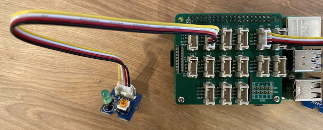

# 开发一个夜灯 - 树莓派

在这个部分的课程中，你会把一个 LED 加到树莓派上并使用它来创建一个夜灯。

## 硬件

现在夜灯需要一个执行器。

这个执行器是 **LED**，一个[发光二极管](https://wikipedia.org/wiki/Light-emitting_diode)，当电流通过它时会发光。这是一个有两个打开或者关闭状态的数字执行器，发送一个 1 值把灯打开，发送 0 值把灯关闭。这个 LED 是一个外部 Grove 执行器，而且需要被连接到树莓派上的 Grove 基础扩展板。

这个夜灯的逻辑用伪代码表示是：

```output
检查光照等级。
如果光照小于 300
    打开 LED
否则
    关闭 LED
```

### 连接 LED

Grove LED 作为一个模块出现，以及一系列可供你选择颜色的 LED。

#### 任务 - 连接 LED

连接 LED。


1. 选择你最喜欢的 LED 然后把引脚插到 LED 模块的两个洞里面。

    LED 是发光二极管，而且二极管是只允许电流单个方向通过的电子设备。这意味 LED 需要被连接在正确的方向，不然就不会工作。

    LED 引脚中的一个是正极引脚，另一个是负极引脚。LED 不是完全的圆形，而且在一边是有些平的。这略平的一边是负极引脚。当你连接 LED 到这个模块的时候，需要确保圆形这边的引脚是连接到模块上外边标着 **+** 的插孔，而扁平的这边是连接到靠近模块中间的插孔。

1. LED 模块有一个允许你控制亮度的旋转按钮，用一个小十字螺丝起子逆时针旋转它拧到头来完全打开它。

1. 把 Grove 线缆的一端插到 LED 模块的插孔中，这个只能从一个方向插入。

1. 在树莓派断电的情况下，把 Grove 线缆的另一端连接到树莓派上插着的 Grove 基础扩展板标着 **D5** 的数字插孔。这个插孔在靠近 GPIO 引脚的一排，左数第二个。



## 编写夜灯程序

现在夜灯可以用 Grove 光照传感器和 Grove LED 来编码了。

### 任务 - 编写夜灯程序

编写夜灯程序

1. 打开树莓派并等待启动完成。

1. 直接在树莓派上或者通过远程 SSH 扩展，打开你在这个作业上一部分创建的 VS Code 中的夜灯项目。

1. 把下面的代码加到 `app.py` 文件中来导入一个需要的函数库。这一行需要加在文件顶部，在其他 `import` 代码行下面。

    ```python
    from grove.grove_led import GroveLed
    ```
    `from grove.grove_led import GroveLed` 语句从 Grove Python 函数库中导入了 `GroveLED`。这个函数库中有和 Grove LED 交互的代码。

1. 把下面的代码加到 `light_sensor` 声明之后来创建一个管理 LED 的类的实例：

    ```python
    led = GroveLed(5)
    ```

    `led = GroveLed(5)` 这一行创建了一个连接到 **D5** 引脚的 `GroveLED` 类的实例，**D5** 也就是 LED 连接的那个数字 Grove 引脚。

    > 💁 所有的插孔都有唯一的引脚号，引脚 0、2、4 和 6 是模拟引脚，引脚 5、16、18、22、24 和 26 是数字引脚。

1. 在 `while` 循环中增加一个判断，在 `time.sleep` 之前来检查光照等级并控制 LED 打开或者关闭：

    ```python
    if light < 300:
        led.on()
    else:
        led.off()
    ```

    这块代码检查了 `light` 的值，如果小于 300 就调用 `GroveLED` 类的 `on` 方法，来发送一个数字值 1 到 LED，把它点亮。如果 `light` 值大于或等于 300，就调用 `off` 方法，发送一个数字值 0 给 LED，把它关闭。

    > 💁 这段代码需要放到 while 循环里面，缩进到和 `print('Light level:', light)` 行一个水平。

    > 💁 当发送数字值到执行器的时候，0 值就是 0V，1 值就是设备的最大电压。对于插着 Grove 传感器和执行器的树莓派而言，1 的电压就是 3.3V。

1. 从 VS Code 终端，运行下面的命令来运行你的 Python 应用：

    ```sh
    python3 app.py
    ```

    光照值在终端里输出。

    ```output
    pi@raspberrypi:~/nightlight $ python3 app.py 
    Light level: 634
    Light level: 634
    Light level: 634
    Light level: 230
    Light level: 104
    Light level: 290
    ```

1. 遮挡和揭开光照传感器，会观察到光照等级等于 300 或更小时 LED 会点亮，如果光照等级比 300 大 LED 就会关闭。

    > 💁 如果 LED 没有点亮，确保它是正确方向连接的，而且旋转按钮是设置成全开的。


> 💁 你可以在 [code-actuator/pi](../code-actuator/pi) 文件夹里找到这份代码。

😀 你的夜灯程序就成功了！
