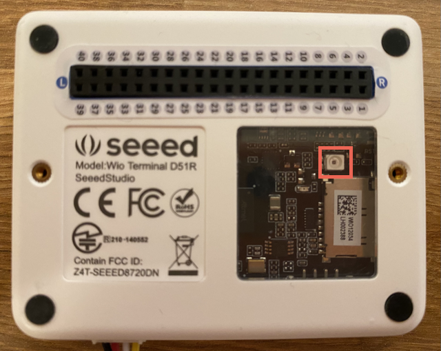

# Add a sensor - Wio Terminal

In this part of the lesson, you will use the light sensor on your Wio Terminal.

## Hardware

The sensor for this lesson is a **light sensor** that uses a [photodiode](https://wikipedia.org/wiki/Photodiode) to convert light to an electrical signal. This is an analog sensor that sends an integer value from 0 to 1,023 indicating a relative amount of light that doesn't map to any standard unit of measurement such as [lux](https://wikipedia.org/wiki/Lux).

The light sensor is built into the Wio Terminal and is visible through the clear plastic window on the back.



## Program the light sensor

The device can now be programmed to use the built in light sensor.

### Task

Program the device.

1. Open the nightlight project in VS Code that you created in the previous part of this assignment

1. Add the following  line to the bottom of the `setup` function:

    ```cpp
    pinMode(WIO_LIGHT, INPUT);
    ```

    This line configures the pins used to communicate with the sensor hardware.

    The `WIO_LIGHT` pin is the number of the GPIO pin connected to the on-board light sensor. This pin is set to `INPUT`, meaning it connects to a sensor and data will be read from the pin.

1. Delete the contents of the `loop` function.

1. Add the following code to the now empty `loop` function.

    ```cpp
    int light = analogRead(WIO_LIGHT);
    Serial.print("Light value: ");
    Serial.println(light);
    ```

    This code reads an analog value from the `WIO_LIGHT` pin. This reads a value from 0-1,023 from the on-board light sensor. This value is then sent to the serial port so you can read it in the Serial Monitor when this code is running. `Serial.print` writes the text without a new line on the end, so each line will start with `Light value:` and end with the actual light value.

1. Add a small delay of one second (1,000ms) at the end of the `loop` as the light levels don't need to be checked continuously. A delay reduces the power consumption of the device.

    ```cpp
    delay(1000);
    ```

1. Reconnect the Wio Terminal to your computer, and upload the new code as you did before.

1. Connect the Serial Monitor.Light values will be output to the terminal. Cover and uncover the light sensor on the back of the Wio Terminal, and the values will change.

    ```output
    > Executing task: platformio device monitor <

    --- Available filters and text transformations: colorize, debug, default, direct, hexlify, log2file, nocontrol, printable, send_on_enter, time
    --- More details at http://bit.ly/pio-monitor-filters
    --- Miniterm on /dev/cu.usbmodem101  9600,8,N,1 ---
    --- Quit: Ctrl+C | Menu: Ctrl+T | Help: Ctrl+T followed by Ctrl+H ---
    Light value: 4
    Light value: 5
    Light value: 4
    Light value: 158
    Light value: 343
    Light value: 348
    Light value: 344
    ```

> 💁 You can find this code in the [code-sensor/wio-terminal](code-sensor/wio-terminal) folder.

😀 Adding a sensor to your nightlight program was a success!
