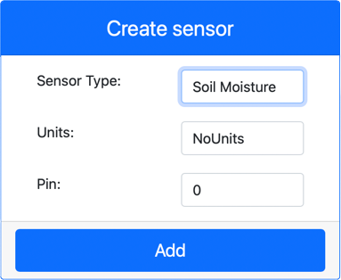
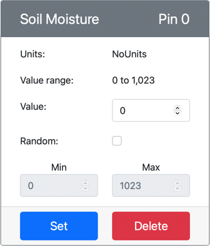

# Mesurer l'humidité du sol - Matériel IoT Virtuel

Dans cette partie de la leçon, vous allez ajouter un capteur capacitif d'humidité du sol à votre dispositif IoT virtuel, et lire des valeurs à partir de celui-ci.

## Matériel virtuel

Le dispositif IoT virtuel utilisera un capteur d'humidité du sol capacitif Grove simulé. Ainsi, ce laboratoire est identique à l'utilisation d'un Raspberry Pi avec un capteur d'humidité du sol capacitif Grove physique.

Dans un dispositif IoT physique, le capteur d'humidité du sol serait un capteur capacitif qui mesure l'humidité du sol en détectant la capacité du sol, une propriété qui change en fonction de l'humidité du sol. Lorsque l'humidité du sol augmente, la tension diminue.

Il s'agit d'un capteur analogique, qui utilise donc un ADC 10 bits simulé pour rapporter une valeur de 1 à 1023.

### Ajouter le capteur d'humidité du sol à CounterFit

Pour utiliser un capteur d'humidité du sol virtuel, vous devez l'ajouter à l'application CounterFit.

#### Tâche - Ajout du capteur d'humidité du sol à CounterFit

Ajoutez le capteur d'humidité du sol à l'application CounterFit.

1. Créez une nouvelle application Python sur votre ordinateur dans un dossier appelé `soil-moisture-sensor` avec un seul fichier appelé `app.py` et un environnement virtuel Python, et ajoutez les paquets pip de CounterFit.

    > ⚠️ Vous pouvez vous référer [aux instructions pour créer et configurer un projet Python CounterFit dans la leçon 1 si nécessaire](../../../../1-getting-started/lessons/1-introduction-to-iot/virtual-device.fr.md).

1. Assurez-vous que l'application web CounterFit est en cours d'exécution.

1. Créez un capteur d'humidité du sol :

    1. Dans la case *Create sensor* du volet *Sensors*, déroulez la case *Sensor type* et sélectionnez *Soil Moisture*.

    1. Laissez le paramètre *Units* sur *NoUnits*.

    1. Assurez-vous que le paramètre *Pin* est réglée sur *0*.

    1. Sélectionnez le bouton **Add** pour créer le capteur d'humidité sur la broche 0.

    

    Le capteur d'humidité du sol sera créé et apparaîtra dans la liste des capteurs.

    

## Programmez l'application du capteur d'humidité du sol

L'application du capteur d'humidité du sol peut maintenant être programmée en utilisant les capteurs CounterFit.

### Tâche - programmer l'application du capteur d'humidité du sol

Programmez l'application du capteur d'humidité du sol.

1. Assurez-vous que l'application "Soil-Moisture-Sensor" est ouverte dans VS Code.

1. Ouvrez le fichier `app.py`.

1. Ajoutez le code suivant au début de `app.py` pour connecter l'application à CounterFit :

    ```python
    from counterfit_connection import CounterFitConnection
    CounterFitConnection.init('127.0.0.1', 5000)
    ```

1. Ajoutez le code suivant au fichier `app.py` pour importer certaines bibliothèques requises :

    ```python
    import time
    from counterfit_shims_grove.adc import ADC
    ```

    L'instruction `import time` importe le module `time` qui sera utilisé plus tard dans ce devoir.

    L'instruction `from counterfit_shims_grove.adc import ADC` importe la classe `ADC` pour interagir avec un convertisseur analogique-numérique virtuel qui peut se connecter à un capteur CounterFit.

1. Ajoutez le code suivant en dessous pour créer une instance de la classe `ADC` :

    ```python
    adc = ADC()
    ```

1. Ajoutez une boucle infinie qui lit à partir de cet ADC sur la broche 0 et écrit le résultat sur la console. Cette boucle peut ensuite dormir pendant 10 secondes entre les lectures.

    ```python
    while True:
        soil_moisture = adc.read(0)
        print("Soil moisture:", soil_moisture)
    
        time.sleep(10)
    ```

1. Depuis l'application CounterFit, modifiez la valeur de la sonde d'humidité du sol qui sera lue par l'application. Vous pouvez le faire de deux façons :

    * Saisissez un nombre dans la case *Value* pour le capteur d'humidité du sol, puis sélectionnez le bouton **Set**. Le nombre que vous saisissez sera la valeur renvoyée par le capteur.

    * Cochez la case *Random* et saisissez une valeur *Min* et *Max*, puis sélectionnez le bouton **Set**. Chaque fois que le capteur lit une valeur, il lit un nombre aléatoire entre *Min* et *Max*.

1. Exécutez l'application Python. Vous verrez les mesures d'humidité du sol écrites dans la console. Changez les paramètres *Value* ou *Random* pour voir la valeur changer.

    ```output
    (.venv) ➜ soil-moisture-sensor $ python app.py 
    Soil moisture: 615
    Soil moisture: 612
    Soil moisture: 498
    Soil moisture: 493
    Soil moisture: 490
    Soil Moisture: 388
    ```

> 💁 Vous pouvez trouver ce code dans le [code/virtual-device](../code/virtual-device) folder.

😀 Votre programme de capteurs d'humidité du sol a été un succès !
