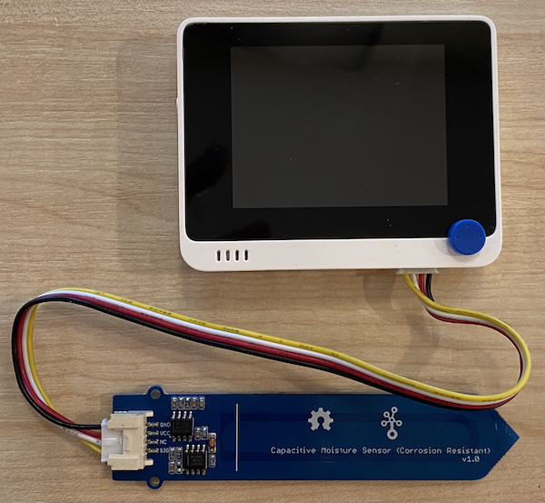

# Mesurer l'humidité du sol - Terminal Wio

Dans cette partie de la leçon, vous allez ajouter un capteur capacitif d'humidité du sol à votre terminal Wio, et lire des valeurs à partir de celui-ci.

## Matériel

Le terminal Wio a besoin d'un capteur capacitif d'humidité du sol.

Le capteur que vous utiliserez est un [Capteur d'humidité du sol capacitif](https://www.seeedstudio.com/Grove-Capacitive-Moisture-Sensor-Corrosion-Resistant.html), qui mesure l'humidité du sol en détectant la capacité du sol, une propriété qui change en fonction de l'humidité du sol. Plus l'humidité du sol augmente, plus la tension diminue.

Il s'agit d'un capteur analogique, qui se connecte donc aux broches analogiques de la borne Wio, en utilisant un ADC intégré pour créer une valeur de 0-1,023.

### Connecter le capteur d'humidité du sol

Le capteur d'humidité du sol Grove peut être connecté au port analogique/numérique configurable des terminaux Wio.

#### Tâche - connecter le capteur d'humidité du sol

Connectez le capteur d'humidité du sol.


1. Insérez une extrémité d'un câble Grove dans la prise du capteur d'humidité du sol. Il ne peut être inséré que dans un seul sens.

1. Le terminal Wio étant déconnecté de votre ordinateur ou de toute autre source d'alimentation, connectez l'autre extrémité du câble Grove à la prise Grove de droite du terminal Wio lorsque vous regardez l'écran. Il s'agit de la prise la plus éloignée du bouton d'alimentation.



1. Insérez le capteur d'humidité du sol dans le sol. Il est doté d'une " ligne de position la plus élevée ", une ligne blanche qui traverse le capteur. Insérez le capteur jusqu'à cette ligne mais sans la dépasser.


1. Vous pouvez maintenant connecter le terminal Wio à votre ordinateur.

## Programmer le capteur d'humidité du sol

Le terminal Wio peut maintenant être programmé pour utiliser la sonde d'humidité du sol jointe.

### Tâche - programmer le capteur d'humidité du sol

Programmez l'appareil.

1. Créez un tout nouveau projet Wio Terminal en utilisant PlatformIO. Appelez ce projet `soil-moisture-sensor`. Ajoutez du code dans la fonction `setup` pour configurer le port série.

    > ⚠️ Vous pouvez vous référer [aux instructions pour créer un projet PlatformIO dans le projet 1, leçon 1 si nécessaire](../../../../1-getting-started/lessons/1-introduction-to-iot/wio-terminal.fr.md).

1. Il n'y a pas de bibliothèque pour ce capteur, à la place vous pouvez lire la broche analogique en utilisant la fonction Arduino intégré [`analogRead`](https://www.arduino.cc/reference/en/language/functions/analog-io/analogread/). Commencez par configurer la broche analogique pour l'entrée afin que les valeurs puissent être lues en ajoutant ce qui suit à la fonction `setup`.

    ```cpp
    pinMode(A0, INPUT);
    ```

    Ceci définit la broche `A0`, la broche combinée analogique/numérique, comme une broche d'entrée sur laquelle la tension peut être lue.

1. Ajoutez ce qui suit à la fonction `loop` pour lire la tension de cette broche :

    ```cpp
    int soil_moisture = analogRead(A0);
    ```

1. Sous ce code, ajoutez le code suivant pour imprimer la valeur sur le port série :

    ```cpp
    Serial.print("Soil Moisture: ");
    Serial.println(soil_moisture);
    ```

1. Enfin, ajoutez un délai à la fin de 10 secondes :

    ```cpp
    delay(10000);
    ```

1. Construisez et téléchargez le code sur le terminal Wio.

    > ⚠️ Vous pouvez vous référer [aux instructions pour créer un projet PlatformIO dans le projet 1, leçon 1 si nécessaire](../../../../1-getting-started/lessons/1-introduction-to-iot/wio-terminal.fr.md).

1. Une fois téléchargé, vous pouvez surveiller l'humidité du sol à l'aide du moniteur série. Ajoutez un peu d'eau au sol, ou retirez le capteur du sol, et observez le changement de valeur.

    ```output
    > Executing task: platformio device monitor <
    
    --- Available filters and text transformations: colorize, debug, default, direct, hexlify, log2file, nocontrol, printable, send_on_enter, time
    --- More details at http://bit.ly/pio-monitor-filters
    --- Miniterm on /dev/cu.usbmodem1201  9600,8,N,1 ---
    --- Quit: Ctrl+C | Menu: Ctrl+T | Help: Ctrl+T followed by Ctrl+H ---
    Soil Moisture: 526
    Soil Moisture: 529
    Soil Moisture: 521
    Soil Moisture: 494
    Soil Moisture: 454
    Soil Moisture: 456
    Soil Moisture: 395
    Soil Moisture: 388
    Soil Moisture: 394
    Soil Moisture: 391
    ```

    Dans l'exemple de sortie ci-dessus, vous pouvez voir la chute de tension lorsque de l'eau est ajoutée.

> 💁 Vous pouvez trouver ce code dans le fichier [code/wio-terminal](../code/wio-terminal).

😀 Votre programme de capteurs d'humidité du sol a été un succès !
