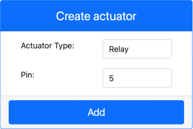
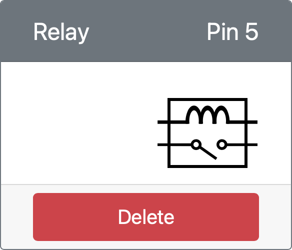
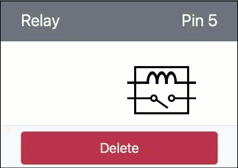

# Control a relay - Virtual IoT Hardware

In this part of the lesson, you will add a relay to your virtual IoT device in addition to the soil moisture sensor, and control it based off the soil moisture level.

## Virtual Hardware

The virtual IoT device will use a simulated Grove relay. This keeps this lab the same as using a Raspberry Pi with a physical Grove relay.

In a physical IoT device, the relay would be a normally-open relay (meaning the output circuit is open, or disconnected when there is no signal sent to the relay). A relay like this can handle output circuits up to 250V and 10A.

### Add the relay to CounterFit

To use a virtual relay, you need to add it to the CounterFit app

#### Task

Add the relay to the CounterFit app.

1. Open the `soil-moisture-sensor` project from the last lesson in VS Code if it's not already open. You will be adding to this project.

1. Make sure the CounterFit web app is running

1. Create a relay:

    1. In the *Create actuator* box in the *Actuators* pane, drop down the *Actuator type* box and select *Relay*.

    1. Set the *Pin* to *5*

    1. Select the **Add** button to create the relay on Pin 5

    

    The relay will be created and appear in the actuators list.

    

## Program the relay

The soil moisture sensor app can now be programmed to use the virtual relay.

### Task

Program the virtual device.

1. Open the `soil-moisture-sensor` project from the last lesson in VS Code if it's not already open. You will be adding to this project.

1. Add the following code to the `app.py` file below the existing imports:

    ```python
    from counterfit_shims_grove.grove_relay import GroveRelay
    ```

    This statement imports the `GroveRelay` from the Grove Python shim libraries to interact with the virtual Grove relay.

1. Add the following code below the declaration of the `ADC` class to create a `GroveRelay` instance:

    ```python
    relay = GroveRelay(5)
    ```

    This creates a relay using pin **5**, the pin you connected the relay to.

1. To test the relay is working, add the following to the `while True:` loop:

    ```python
    relay.on()
    time.sleep(.5)
    relay.off()
    ```

    The code turns the relay on, waits 0.5 seconds, then turns the relay off.

1. Run the Python app. The relay will turn on and off every 10 seconds, with a half second delay between turning on and off. You will see the virtual relay in the CounterFit app close and open as the relay is turned on and off.

    

## Control the relay from soil moisture

Now that the relay is working, it can be controlled in response to soil moisture readings.

### Task

Control the relay.

1. Delete the 3 lines of code that you added to test the relay. Replace them with the following code in its place:

    ```python
    if soil_moisture > 450:
        print("Soil Moisture is too low, turning relay on.")
        relay.on()
    else:
        print("Soil Moisture is ok, turning relay off.")
        relay.off()
    ```

    This code checks the soil moisture level from the soil moisture sensor. If it is above 450, it turns on the relay, turning it off if it goes below 450.

    > 💁 Remember the capacitive soil moisture sensor reads the lower the soil moisture level, the more moisture there is in the soil and vice versa.

1. Run the Python app. You will see the relay turn on or off depending on the soil moisture levels. Change the *Value* or the *Random* settings for the soil moisture sensor to see the value change.

    ```output
    Soil Moisture: 638
    Soil Moisture is too low, turning relay on.
    Soil Moisture: 452
    Soil Moisture is too low, turning relay on.
    Soil Moisture: 347
    Soil Moisture is ok, turning relay off.
    ```

> 💁 You can find this code in the [code-relay/virtual-device](code-relay/virtual-device) folder.

😀 Your virtual soil moisture sensor controlling a relay program was a success!
