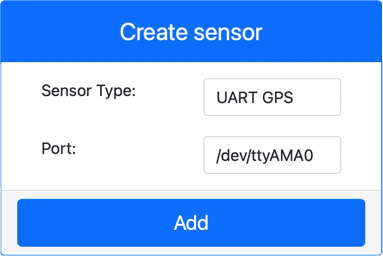
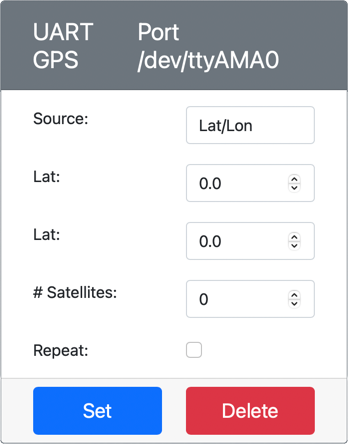
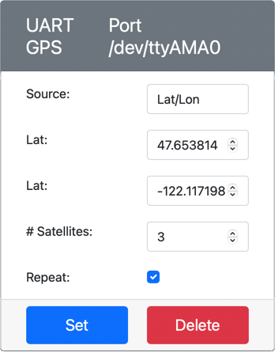
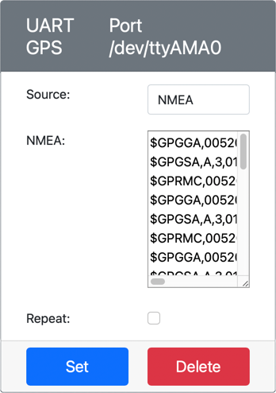
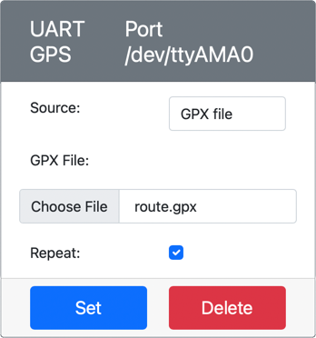

# Read GPS data - Virtual IoT Hardware

In this part of the lesson, you will add a GPS sensor to your virtual IoT device, and read values from it.

## Virtual Hardware

The virtual IoT device will use a simulated GPS sensor that is accessible over UART via a serial port.

A physical GPS sensor will have an antenna to pick up radio waves from GPS satellites, and convert the GPS signals into GPS data. The virtual version simulates this by allowing you to either set a latitude and longitude,  send raw NMEA sentences, or to upload a GPX file with multiple locations that can be returned sequentially.

> 🎓 NMEA sentences will be covered later in this lesson

### Add the sensor to CounterFit

To use a virtual GPS sensor, you need to add one to the CounterFit app

#### Task - add the sensor to CounterFit

Add the GPS sensor to the CounterFit app.

1. Create a new Python app on your computer in a folder called `gps-sensor` with a single file called `app.py` and a Python virtual environment, and add the CounterFit pip packages.

    > ⚠️ You can refer to [the instructions for creating and setting up a CounterFit Python project in lesson 1 if needed](../../../1-getting-started/lessons/1-introduction-to-iot/virtual-device.md).

1. Install an additional Pip package to install a CounterFit shim that can talk to UART based sensors over a serial connection. Make sure you are installing this from a terminal with the virtual environment activated.

    ```sh
    pip install counterfit-shims-serial
    ```

1. Make sure the CounterFit web app is running

1. Create a GPS sensor:

    1. In the *Create sensor* box in the *Sensors* pane, drop down the *Sensor type* box and select *UART GPS*.

    1. Leave the *Port* set to */dev/ttyAMA0*

    1. Select the **Add** button to create the GPS sensor on port `/dev/ttyAMA0`

    

    The GPS sensor will be created and appear in the sensors list.

    

## Program the GPS sensor

The Virtual IoT device can now be programmed to use the virtual GPS sensor.

### Task - program the GPS sensor

Program the GPS sensor app.

1. Make sure the `gps-sensor` app is open in VS Code

1. Open the `app.py` file

1. Add the following code to the top of `app.py` to connect the app to CounterFit:

    ```python
    from counterfit_connection import CounterFitConnection
    CounterFitConnection.init('127.0.0.1', 5000)
    ```

1. Add the following code below this to import some needed libraries, including the library for the CounterFit serial port:

    ```python
    import time
    import counterfit_shims_serial
    
    serial = counterfit_shims_serial.Serial('/dev/ttyAMA0')
    ```

    This code imports the `serial` module from the `counterfit_shims_serial` Pip package. It then connects to the `/dev/ttyAMA0` serial port - this is the address of the serial port that the virtual GPS sensor uses for its UART port.

1. Add the following code below this to read from the serial port and print the values to the console:

    ```python
    def print_gps_data(line):
        print(line.rstrip())
    
    while True:
        line = serial.readline().decode('utf-8')
    
        while len(line) > 0:
            print_gps_data(line)
            line = serial.readline().decode('utf-8')
    
        time.sleep(1)
    ```

    A function called `print_gps_data` is defined that prints out the line passed to it to the console.

    Next the code loops forever, reading as many lines of text as it can from the serial port in each loop. It calls the `print_gps_data` function for each line.

    After all the data has been read, the loop sleeps for 1 second, then tries again.

1. Run this code, ensuring you are using a different terminal to the one that the CounterFit app is running it, so that the CounterFit app remains running.

1. From the CounterFit app, change the value of the gps sensor. You can do this in one of these ways:

    * Set the **Source** to `Lat/Lon`, and set an explicit latitude, longitude and number of satellites used to get the GPS fix. This value will be sent only once, so check the **Repeat** box to have the data repeat every second.

      

    * Set the **Source** to `NMEA` and add some NMEA sentences into the text box. All these values will be sent, with a delay of 1 second before each new GGA (position fix) sentence can be read.

      

      You can use a tool like [nmeagen.org](https://www.nmeagen.org) to generate these sentences by drawing on a map. These values will be sent only once, so check the **Repeat** box to have the data repeat one second after it has all been sent.

    * Set the **Source** to GPX file, and upload a GPX file with track locations. You can download GPX files from a number of popular mapping and hiking sites, such as [AllTrails](https://www.alltrails.com/). These files contain multiple GPS locations as a trail, and the GPS sensor will return each new location at 1 second intervals.

      

      These values will be sent only once, so check the **Repeat** box to have the data repeat one second after it has all been sent.

    Once you have configured the GPS settings, select the **Set** button to commit these values to the sensor.

1. You will see the raw output from the GPS sensor, something like the following:

    ```output
    $GNGGA,020604.001,4738.538654,N,12208.341758,W,1,3,,164.7,M,-17.1,M,,*67
    $GNGGA,020604.001,4738.538654,N,12208.341758,W,1,3,,164.7,M,-17.1,M,,*67
    ```

> 💁 You can find this code in the [code-gps/virtual-device](code-gps/virtual-device) folder.

😀 Your GPS sensor program was a success!
