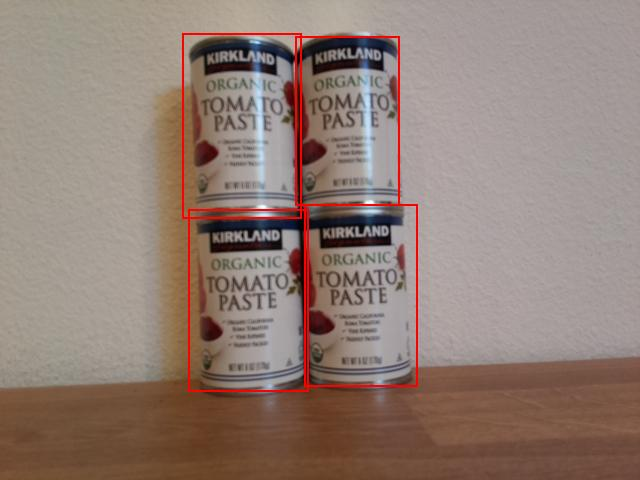

# Count stock from your IoT device - Wio Terminal

A combination of the predictions and their bounding boxes can be used to count stock in an image.

## Count stock



In the image shown above, the bounding boxes have a small overlap. If this overlap was much larger, then the bounding boxes may indicate the same object. To count the objects correctly, you need to ignore boxes with a significant overlap.

### Task - count stock ignoring overlap

1. Open your `stock-counter` project if it is not already open.

1. Above the `processPredictions` function, add the following code:

    ```cpp
    const float overlap_threshold = 0.20f;
    ```

    This defines the percentage overlap allowed before the bounding boxes are considered to be the same object. 0.20 defines a 20% overlap.

1. Below this, and above the `processPredictions` function, add the following code to calculate the overlap between two rectangles:

    ```cpp
    struct Point {
        float x, y;
    };

    struct Rect {
        Point topLeft, bottomRight;
    };

    float area(Rect rect)
    {
        return abs(rect.bottomRight.x - rect.topLeft.x) * abs(rect.bottomRight.y - rect.topLeft.y);
    }
     
    float overlappingArea(Rect rect1, Rect rect2)
    {
        float left = max(rect1.topLeft.x, rect2.topLeft.x);
        float right = min(rect1.bottomRight.x, rect2.bottomRight.x);
        float top = max(rect1.topLeft.y, rect2.topLeft.y);
        float bottom = min(rect1.bottomRight.y, rect2.bottomRight.y);
    
    
        if ( right > left && bottom > top )
        {
            return (right-left)*(bottom-top);
        }
        
        return 0.0f;
    }
    ```

    This code defines a `Point` struct to store points on the image, and a `Rect` struct to define a rectangle using a top left and bottom right coordinate. It then defines an `area` function that calculates the area of a rectangle from a top left and bottom right coordinate.

    Next it defines a `overlappingArea` function that calculates the overlapping area of 2 rectangles. If they don't overlap, it returns 0.

1. Below the `overlappingArea` function, declare a function to convert a bounding box to a `Rect`:

    ```cpp
    Rect rectFromBoundingBox(JsonVariant prediction)
    {
        JsonObject bounding_box = prediction["boundingBox"].as<JsonObject>();
    
        float left = bounding_box["left"].as<float>();
        float top = bounding_box["top"].as<float>();
        float width = bounding_box["width"].as<float>();
        float height = bounding_box["height"].as<float>();
    
        Point topLeft = {left, top};
        Point bottomRight = {left + width, top + height};
    
        return {topLeft, bottomRight};
    }
    ```

    This takes a prediction from the object detector, extracts the bounding box and uses the values on the bounding box to define a rectangle. The right side is calculated from the left plus the width. The bottom is calculated as the top plus the height.

1. The predictions need to be compared to each other, and if 2 predictions have an overlap of more that the threshold, one of them needs to be deleted. The overlap threshold is a percentage, so needs to be multiplied by the size of the smallest bounding box to check that the overlap exceeds the given percentage of the bounding box, not the given percentage of the whole image. Start by deleting the content of the `processPredictions` function.

1. Add the following to the empty `processPredictions` function:

    ```cpp
    std::vector<JsonVariant> passed_predictions;

    for (int i = 0; i < predictions.size(); ++i)
    {
        Rect prediction_1_rect = rectFromBoundingBox(predictions[i]);
        float prediction_1_area = area(prediction_1_rect);
        bool passed = true;

        for (int j = i + 1; j < predictions.size(); ++j)
        {
            Rect prediction_2_rect = rectFromBoundingBox(predictions[j]);
            float prediction_2_area = area(prediction_2_rect);

            float overlap = overlappingArea(prediction_1_rect, prediction_2_rect);
            float smallest_area = min(prediction_1_area, prediction_2_area);

            if (overlap > (overlap_threshold * smallest_area))
            {
                passed = false;
                break;
            }
        }

        if (passed)
        {
            passed_predictions.push_back(predictions[i]);
        }
    }
    ```

    This code declares a vector to store the predictions that don't overlap. It then loops through all the predictions, creating a `Rect` from the bounding box.

    Next this code loops through the remaining predictions, starting at the one after the current prediction. This stops predictions being compared more than once - once 1 and 2 have been compared, there's no need to compare 2 with 1, only with 3, 4, etc.

    For each pair of predictions the overlapping area is calculated. This is then compared to the area of the smallest bounding box - if the overlap exceeds the threshold percentage of the smallest bounding box, the prediction is marked as not passed. If after comparing all the overlap, the prediction passes the checks it is added to the `passed_predictions` collection.

    > 💁 This is very simplistic way to remove overlaps, just removing the first one in an overlapping pair. For production code, you would want to put more logic in here, such as considering the overlaps between multiple objects, or if one bounding box is contained by another.

1. After this, add the following code to send details of the passed predictions to the serial monitor:

    ```cpp
    for(JsonVariant prediction : passed_predictions)
    {
        String boundingBox = prediction["boundingBox"].as<String>();
        String tag = prediction["tagName"].as<String>();
        float probability = prediction["probability"].as<float>();

        char buff[32];
        sprintf(buff, "%s:\t%.2f%%\t%s", tag.c_str(), probability * 100.0, boundingBox.c_str());
        Serial.println(buff);
    }
    ```

    This code loops through the passed predictions and prints their details to the serial monitor.

1. Below this, add code to print the number of counted items to the serial monitor:

    ```cpp
    Serial.print("Counted ");
    Serial.print(passed_predictions.size());
    Serial.println(" stock items.");
    ```

    This could then be sent to an IoT service to alert if the stock levels are low.

1. Upload and run your code. Point the camera at objects on a shelf and press the C button. Try adjusting the `overlap_threshold` value to see predictions being ignored.

    ```output
    Connecting to WiFi..
    Connected!
    Image captured
    Image read to buffer with length 17416
    tomato paste:   35.84%  {"left":0.395631,"top":0.215897,"width":0.180768,"height":0.359364}
    tomato paste:   35.87%  {"left":0.378554,"top":0.583012,"width":0.14824,"height":0.359382}
    tomato paste:   34.11%  {"left":0.699024,"top":0.592617,"width":0.124411,"height":0.350456}
    tomato paste:   35.16%  {"left":0.513006,"top":0.647853,"width":0.187472,"height":0.325817}
    Counted 4 stock items.
    ```

> 💁 You can find this code in the [code-count/wio-terminal](code-count/wio-terminal) folder.

😀 Your stock counter program was a success!
